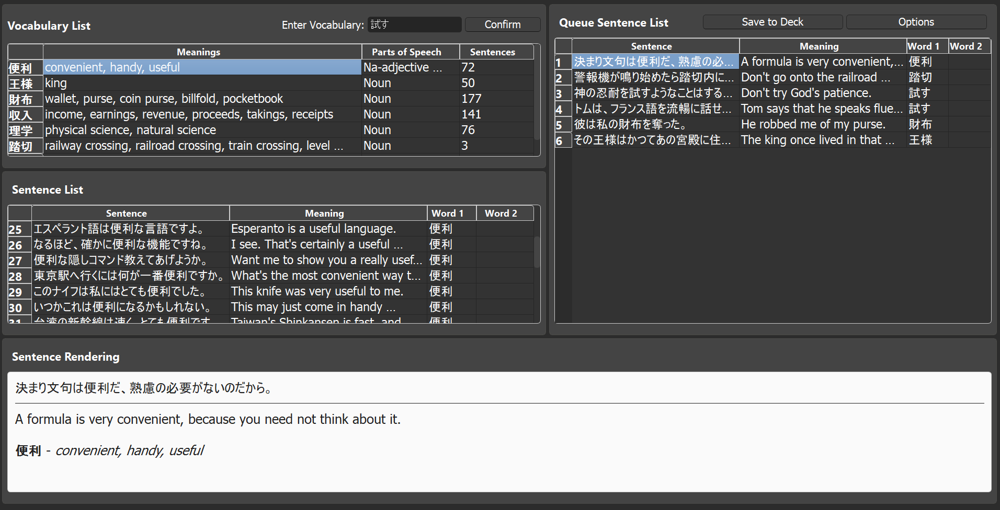

# KankiMate: Automating Japanese Vocabulary Note Creation for Anki

## Overview
This add-on automates and simplifies the creation of notes for learning new words in a foreign language. By entering a word, the application retrieves information about the word (definitions, part of speech...) and retrieves phrases from the Internet or a database. 
It also allows you to customize your notes according to your templates, with the phrases, and add them to your deck. 


## Features
- **Automated Note Creation**: Generates Anki notes from a single Japanese word.
- **Rich Data Extraction**: Includes readings, meanings, and example sentences.
- **Customizable Note Fields**: Compatible with various note types and field configurations.
- **Dark Mode Friendly**: Optimized for users who prefer studying in Dark Mode.

## Installation
1. **Download the Addon**:
   - Clone this repository.  ~~or download the latest release as a `.zip` file.~~

   ```bash
   git clone https://github.com/yanisju/KankiMate
   ```

2. **Install the Addon**:
   - Move the addon folder into your Anki addons directory:
     - On Windows: `C:\Users\YourUsername\AppData\Roaming\Anki2\addons21`
     - On macOS/Linux: `~/Anki2/addons21`

3. **Restart Anki**:
   - Relaunch Anki to activate the addon.

## Usage
1. Open Anki.
2. Navigate to 'Tools' > 'KankiMate' in Anki's main menu.
3. Enter a Japanese word in the input box next to "Enter Vocabulary" and click "Confirm".
4. Double-click on the vocabulary to select or modify its definition and part of speech.
5. Double-click on a sentence to modify the sentence, translation, or vocabulary in the sentence.
6. Click "Confirm and Add to Queue" to add the sentence to the deck, or right-click on the sentence and select "Add to Queue".
7. Modify the Deck and Model options in "Queue Options".
8. Click "Save to Deck" to add the sentence to the specified deck in the Anki database.

Here is a screenshot of the KankiMate interface:



## Requirements
- Anki 2.1.x
- Internet connection (for retrieving vocabulary details)

## Configuration
To customize the addon to suit your needs:
1. Open the settings file (`config.json`) in the addon folder.
2. Modify fields such as:
   - Default note type
   - Fields mapping (e.g., "Kanji", "Reading", "Meaning")
   - API settings (for fetching vocabulary data)

## Contributing
Contributions are welcome! If you have suggestions, bug reports, or feature requests, please:
1. Open an issue on the [GitHub repository](https://github.com/yanisju/KankiMate/issues).
2. Submit a pull request with your changes.

## License
This project is licensed under the MIT License. See the `LICENSE` file for details.

## Acknowledgments
- The Anki team for creating such a powerful learning platform.
- Open-source Japanese dictionary APIs for enabling accurate and rich data extraction.
